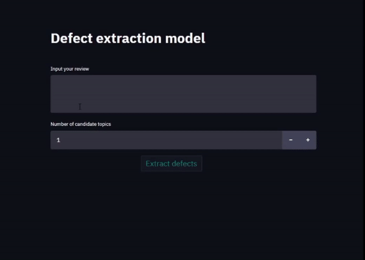
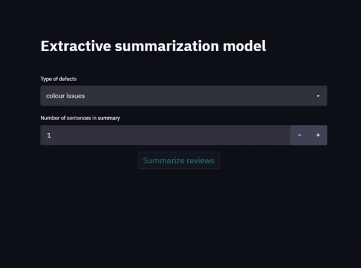

# Product Defect Mining
This project seeks to uncover potential product quality issues that may exist in product reviews. This allows the client
to reduce any risks and uncertainties, and may even create hidden value out of the generated insights.

# 📝 Table of Contents
- [🧐 Problem Statement](#-problem-statement)
- [🏁 Getting started](#-getting-started)
- [📁 Project structure](#-project-structure)
- [🎈 Usage](#-usage)
- [📺 Demo](#-demo)

# 🧐 Problem Statement 
Product defects are usually damaging to a business' reputation. In some cases, there may be opportunities to discover them
even before they get to be uncovered through proper channels. In this project, we aim to detect any product defects hidden in massive volumes of online reviews.
Through this, we are able to tackle and minimize any further negative reviews and investigate the appropriate defects.

# 🏁 Getting started
These instructions will get you a copy of the project up and running on your local machine for development and testing purposes.

### Installation
Create the conda environment from the yaml file
```
conda env create -f environment.yml
```

Activate the environment
```
conda activate dvc
```

### Troubleshooting
If unable to install biterm (windows users), install directly from git
```
pip install git+https://github.com/markoarnauto/biterm.git
```

# 📁 Project structure
```
.
├── data/                               
│   ├── raw/                            <- Original immutable data
│   ├── processed/                      <- Processed for use case
│   └── usecase/                        <- Use case specific data
│
├── configs/                            <- Stores configuration options
│
├── data_loader/                        <- DataLoader class to load/generate data
│
├── preprocess/                         <- Preprocessor class for preprocessing data
│
├── models/                             <- Model class to define model structures/params
│
├── trainers/                           <- Trainer class to handle training/inference
│
├── pipeline/                           <- Pipeline scripts to load relevant classes and define logic for entire process
│
├── utils/                              <- Cleaning, processing, misc functions
│
└── notebooks/                          <- Notebooks for visualization/exploration
```

# 🎈 Usage
The project uses DVC to manage pipelines. To train the entire project from start to end,
run the command
```
dvc repro
```

To start the app for visualizations of the trained model (Launches on localhost:8501)
```
streamlit run app/app.py
```


# 📺 Demo

Once the streamlit app has started running, we have 2 tabs: `Defect extraction` and `Defect summarization`

### Defect extraction



### Defect summarization


